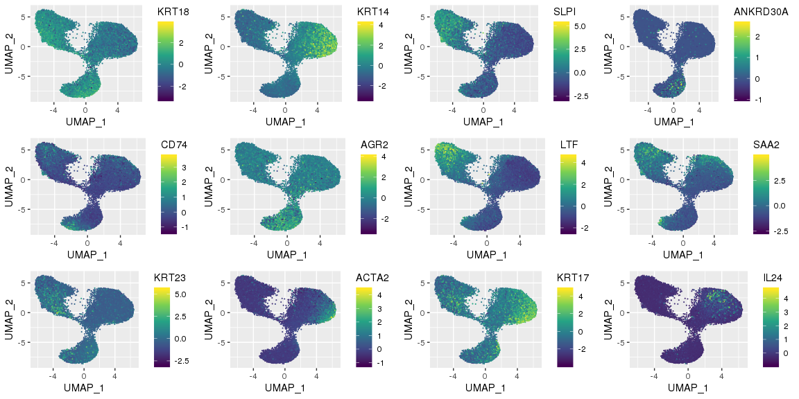

Analysis of integrated breast epithelial atlas
==============================================

``` r
library(Seurat)
library(ggplot2)
```

Nguyen, et. al used 10X Chromium single-cell RNA sequencing to profile mammary epithelial cells of 4 individuals. The raw count data from this experiment were [quality filtered with custom R scripts](https://github.com/jasenjackson/singlecell/blob/master/QC_Kessenbrock.md), normalized for sequencing depth using scTransform and [integrated](https://github.com/jasenjackson/singlecell/blob/master/integrate.R) using Seurat's reference-based integration method.

``` r
BreastAtlas <- readRDS("/projects/b1101/Jasen/data/BreastAtlas.integrated.rds")

# Perform louvain algorithm via the Seurat package to identify cell clusters
BreastAtlas <- FindNeighbors(BreastAtlas, dims = c(1:30), verbose = FALSE)
BreastAtlas <- FindClusters(BreastAtlas, verbose = FALSE)

# Plot by Individual and by Seurat cluster
p1 <- DimPlot(BreastAtlas, reduction = "umap", group.by = "individual", pt.size=0.1) + DarkTheme()
p2 <- DimPlot(BreastAtlas, reduction = "umap", group.by = "seurat_clusters", pt.size=0.1) + DarkTheme()
gridExtra::grid.arrange(p1,p2, ncol=2)
```


Nguyen, et. al identified three primary types of mammary cells: Basal, Luminal 1 (L1) and Luminal 2 (L2). KRT18 was identified as a luminal marker, whereas KRT14 was identified as a basal marker. SLPI and ANKRD30A were identified as marker genes for Luminal 1 and Luminal2 respectively. CD74, AGR2, LTF, SAA2, KRT23, ACTA2, KRT17, and IL24 were identified as within-type marker genes as well. Generally, these marker gene expression patterns were reproducible following integration across datasets.

``` r
featureMap.df <- FetchData(object = BreastAtlas, vars = c("UMAP_1", "UMAP_2",
                                                          "KRT18", "KRT14", "SLPI", "ANKRD30A",
                                                          "CD74", "AGR2", "LTF", "SAA2",
                                                          "KRT23","ACTA2", "KRT17", "IL24"))

p1 <- ggplot(featureMap.df, aes(UMAP_1, UMAP_2, color = KRT18)) + geom_point(size=0.1) + scale_color_viridis_c()
p2 <- ggplot(featureMap.df, aes(UMAP_1, UMAP_2, color = KRT14)) + geom_point(size=0.1) + scale_color_viridis_c()
p3 <- ggplot(featureMap.df, aes(UMAP_1, UMAP_2, color = SLPI)) + geom_point(size=0.1) + scale_color_viridis_c()
p4 <- ggplot(featureMap.df, aes(UMAP_1, UMAP_2, color = ANKRD30A)) + geom_point(size=0.1) + scale_color_viridis_c()
p5 <- ggplot(featureMap.df, aes(UMAP_1, UMAP_2, color = CD74)) + geom_point(size=0.1) + scale_color_viridis_c()
p6 <- ggplot(featureMap.df, aes(UMAP_1, UMAP_2, color = AGR2)) + geom_point(size=0.1) + scale_color_viridis_c()
p7 <- ggplot(featureMap.df, aes(UMAP_1, UMAP_2, color = LTF)) + geom_point(size=0.1) + scale_color_viridis_c()
p8 <- ggplot(featureMap.df, aes(UMAP_1, UMAP_2, color = SAA2)) + geom_point(size=0.1) + scale_color_viridis_c()
p9 <- ggplot(featureMap.df, aes(UMAP_1, UMAP_2, color = KRT23)) + geom_point(size=0.1) + scale_color_viridis_c()
p10 <- ggplot(featureMap.df, aes(UMAP_1, UMAP_2, color = ACTA2)) + geom_point(size=0.1) + scale_color_viridis_c()
p11 <- ggplot(featureMap.df, aes(UMAP_1, UMAP_2, color = KRT17)) + geom_point(size=0.1) + scale_color_viridis_c()
p12 <- ggplot(featureMap.df, aes(UMAP_1, UMAP_2, color = IL24)) + geom_point(size=0.1) + scale_color_viridis_c()

gridExtra::grid.arrange(p1, p2, p3, p4, p5, p6, p7, p8, p9, p10, p11, p12, ncol = 4)
```



``` r
# stash identity
BreastAtlas[["sample_origin"]] <- BreastAtlas[["orig.ident"]]
Idents(object = BreastAtlas) <- BreastAtlas[["seurat_clusters"]]

Misc(object = BreastAtlas, slot = "cluster0.markers") <- tibble::rownames_to_column(FindMarkers(BreastAtlas, ident.1 = "0", ident.2 = NULL, only.pos = TRUE), "gene")
Misc(object = BreastAtlas, slot = "cluster1.markers") <- tibble::rownames_to_column(FindMarkers(BreastAtlas, ident.1 = "1", ident.2 = NULL, only.pos = TRUE), "gene")
Misc(object = BreastAtlas, slot = "cluster2.markers") <- tibble::rownames_to_column(FindMarkers(BreastAtlas, ident.1 = "2", ident.2 = NULL, only.pos = TRUE), "gene")
Misc(object = BreastAtlas, slot = "cluster3.markers") <- tibble::rownames_to_column(FindMarkers(BreastAtlas, ident.1 = "3", ident.2 = NULL, only.pos = TRUE), "gene")
Misc(object = BreastAtlas, slot = "cluster4.markers") <- tibble::rownames_to_column(FindMarkers(BreastAtlas, ident.1 = "4", ident.2 = NULL, only.pos = TRUE), "gene")
Misc(object = BreastAtlas, slot = "cluster5.markers") <- tibble::rownames_to_column(FindMarkers(BreastAtlas, ident.1 = "5", ident.2 = NULL, only.pos = TRUE), "gene")
Misc(object = BreastAtlas, slot = "cluster6.markers") <- tibble::rownames_to_column(FindMarkers(BreastAtlas, ident.1 = "6", ident.2 = NULL, only.pos = TRUE), "gene")
Misc(object = BreastAtlas, slot = "cluster7.markers") <- tibble::rownames_to_column(FindMarkers(BreastAtlas, ident.1 = "7", ident.2 = NULL, only.pos = TRUE), "gene")
Misc(object = BreastAtlas, slot = "cluster8.markers") <- tibble::rownames_to_column(FindMarkers(BreastAtlas, ident.1 = "8", ident.2 = NULL, only.pos = TRUE), "gene")
Misc(object = BreastAtlas, slot = "cluster9.markers") <- tibble::rownames_to_column(FindMarkers(BreastAtlas, ident.1 = "9", ident.2 = NULL, only.pos = TRUE), "gene")
Misc(object = BreastAtlas, slot = "cluster10.markers") <- tibble::rownames_to_column(FindMarkers(BreastAtlas, ident.1 = "10", ident.2 = NULL, only.pos = TRUE), "gene")

#Cluster 0
paste(BreastAtlas@misc$cluster0.markers$gene, collapse=",")
```

    ## [1] "MMP7,SLPI,SAA2,WFDC2,MT-CO2,OVOS2,AKR1C3,PI3,RPS19,RPS12,MT-CO3,MT-CO1,MT-ATP6,MT-ND4,SAA1,SLC25A37,MGP,MT-CYB,CYP1B1,MT-ND1,BTG1,MT-ND2,KRT81,FDCSP"

``` r
#Cluster 1
paste(BreastAtlas@misc$cluster1.markers$gene, collapse=",")
```

    ## [1] "MT2A,S100A2,CCL2,IL24,CXCL8,MT1X,IL1B,PLAU,MMP3,TIMP1,SFN,IER3,AKR1B1,APOE,NNMT,TNFAIP6,IL20,MRGPRX3,FBXO2,SERPINA1,LGALS1,CEBPD,TINAGL1,CSF3,GSTO1,KRT14,SAA1,FEZ1,PDPN,HAS3,TUBA1B,GAPDH,KRT5,CREG1,TPM2,NPPC,PKM,TUBB6,PTTG1,BST2,C1R,PDLIM4,SGK1,MYLK,SERPINB5,KRT6B,MMP14,GSTP1,GCLM,PRMT1,SCPEP1,ISYNA1,RND3,FAM96B,F3,VSNL1,S100A11,PLTP,SLC39A14,APOBEC3G,UCHL1,FGF1,TNC,HBEGF,CYP27B1,ICAM1,TAGLN2,PSMB7,FDX1,PRNP,DKK3,CD82,LDHA,SH3BGRL3,PSMA7,JUNB,IRF6,ID4,NGFR,DRAP1,LAMC2,PLP2,NUPR1,COL17A1,CALD1,VIM,ITGB1,BHLHE41,IGFBP4,NPC2,CTSC,FHL2,YBX3,ATP5G1,CBR1,POLR2L,CD44,PSMB6,MT-ND2,C1S,IFNGR1,GYPC,WBP5,FBXO32,MRPS6,CHI3L1,RAB38,SRSF3,LAMB3,JAG1,CSRP2,MT1E,IGFBP6,SPARCL1,ANGPTL4,G0S2,GPX2,MT1G,AREG"

``` r
#Cluster 2
paste(BreastAtlas@misc$cluster2.markers$gene, collapse=",")
```

    ## [1] "S100A8,LTF,S100A9,SERPINB4,RARRES1,OVOS2,PI3,WFDC2,LCN2,S100A7,SERPINB3,OLFM4,SAA2,FBLN5,SLPI,CHI3L1,AKR1C3,PHLDA1,AKR1C2,MMP7,NDRG2,AZGP1,AKR1C1,KYNU,ZG16B,SERPINB7,CLU,MGP,BTG1,FABP7,SLC25A37,SFRP1,KRT19,PDZK1IP1,CBR3,RCAN1,PROM1,CYP24A1,GLRX,CXCL5,CYBA,PIGR,TTLL4,TCN1,SAA1,ALDH1A3,TNIP3,TNFAIP2,TKT,MT-CO1,CYP1A1,LYPD3,CA8,PLEKHS1,TSC22D1,MT-CO3,C15orf48,SLC39A8,HSD11B1,SLC34A2,HLA-DRA,BBOX1,MT-CO2,EHF,CSTB,VNN1,NFKBIZ,FOS,PLSCR1,TPD52L1,FAH,C9orf16,CLDN3,DBI,AQP5,RPS12,ERRFI1,NOXO1,PDE4B,HMGA1,TPT1-AS1,FDPS,S100A6,PRELID1,MT-CYB,TMEM165,CYP1B1,IDH2,NEURL3,C3,SRD5A3,ASS1,RHOV,SDCBP,RPS4X,ANKRD36C,TRPS1,CHPT1,C2orf82,SLC12A2,RPL3,MT-ATP6,HSD17B2,MT-ND4,ST3GAL4,CARHSP1,EEF1A1,CYP27A1,BPGM,LINC01235,SELENBP1,TLR2,VNN3,RBPMS-AS1,PTP4A3,RPL34,LUCAT1,PRSS22,CCL28,GCHFR,SAT1,CIRBP,RGS10,ARRDC3,TMEM45A,S100A1,TNFAIP6,CITED2,AARD,GLUL,CYB5R2,CD74,LMO4,TALDO1,CXCL1,IL34,PLPP2,SESTD1,CHI3L2,NCCRP1,FDFT1,CMPK1,LY6E,CEBPB,CD14,KCNN4,SORBS2,FXYD3,SDC4,SERPINE2,SDCBP2,ATP6V1B2,HIST1H1C,ATP1B1,ELF3,MFGE8,WTAP,HLA-DRB1,CTSB,MIA,PRDX1,CXCL3,CLDN10,CXCL17,CXCL2,FDCSP,SCGB2A2"

``` r
#Cluster 3
paste(BreastAtlas@misc$cluster3.markers$gene, collapse=",")
```

    ## [1] "TMSB4X,C8orf4,STC2,C15orf48,CD24,AREG,SAT1,HSPB1,ARHGAP29,MDK,SCCPDH,DNAJC12,IL32,CST3,S100A6,PTHLH,TMSB10,MALAT1,CD47,TFPI,KRT8,PTGR1,CD99,CRABP2,DUSP4,STC1,SOX4,TBX3,CYB5A,TSC22D1,PLK2,KRT18,TM4SF1,DEFB1,NDUFV2,CFB,SMIM14,TUBA1A,CLDN7,ADIRF,CLDN4,CFD,ANKRD30A,TPBG,OCIAD2,RAB11FIP1,KRT19,CARHSP1,CALM2,TMC5,CAPG,PPDPF,MARCKSL1,TMEM45B,UGCG,PRSS23,TNFSF10,LURAP1L,MGLL,ABRACL,MYO6,AZGP1,GOLM1,XBP1,TMEM106B,HLA-C,B2M,GDF15,EFHD1,CX3CL1,MYL12B,UCP2,KCCAT211,CXCL6,ALDH2,TMBIM6,FAM213A,MYL12A,TSPAN13,AGR2,SPINT1,EIF4EBP1,KRT23,TSPAN15,ATP1B1,ISG20,ANXA3,LGALS3,SQRDL,KRT7,HLA-B,TACSTD2,ZFP36L1,STMN1,TFAP2A,SLC44A4,MISP,PMAIP1,ANXA6,ASAH1,SRI,GPX4,TXNRD1,CA12,PVRL4,LINC00152,C19orf33,CYR61,SLC3A2,BZW1,ACSL3,H2AFZ,RPS27L,PDLIM1,LMCD1,CIB1,EREG,EZR,MAL2,ADAM9,IFNGR2,LIMCH1,UGDH,USP53,SDR16C5,NTN4,IER2,SLC39A6,FXYD5,MLPH,EDN1,H2AFJ,GSTM3,STEAP4,EMP3,RAB32,HMOX1,EFNA1,TMEM40,SMIM22,TSPAN1,ISG15,DUSP1,CCND1,GPRC5A,TGFB2,PRSS3,AKAP12,PKIB,KRT81,S100P"

``` r
#Cluster 4
paste(BreastAtlas@misc$cluster4.markers$gene, collapse=",")
```

    ## [1] "TAGLN,ACTA2,KRT14,KRT17,MYLK,ACTG2,MYL9,TPM2,ACTB,KRT5,CALD1,SFN,MT2A,ITGB1,GAS6,NNMT,AKR1B1,ACTN1,ADAMTS1,TUBB6,LGALS1,F3,LDHA,GAPDH,TUBA1B,CAV1,FBXO2,DKK3,GYPC,PFN1,TUBB2B,FHL2,TPM4,PRMT1,MRGPRX3,HSP90AB1,MYL12A,CREG1,MYL6,PKM,EIF5A,DRAP1,UCHL1,TUBB,SERPINB5,ACTG1,CNN1,PLP2,FAM96B,TPI1,FEZ1,EFEMP1,AMIGO2,S100A11,GSTO1,PSMB6,ENO1,TINAGL1,VSNL1,RAN,PSMA7,DST,YBX3,TXN,PSMD2,JUNB,PALLD,GCLM,PLS3,CRYAB,ID4,ICAM1,PRNP,ITGA2,ANXA1,VIM,NQO1,HAS3,POLR2L,FBXO32,COL17A1,NME1,PDLIM4,SPP1,PMP22,APOE,ANXA2,PDLIM7,CSRP1,PSMB7,CAV2,TUBB2A,HSPA5,TSPAN4,APRT,TPM1,BST2,MSRB3,TGFB1I1,SRSF3,SELM,PTRF,GSTP1,ANXA5,PSMD14,ATP2B1,PPIB,STK17A,CBR1,CEBPD,PLAU,CCL2,C1QBP,SH3BGRL3,SGK1,PDPN,HSP90B1,SLC1A5,CSRP2,S100A10,WBP5,SERPINH1,FST,PSMC4,ISYNA1,SRSF2,PGK1,SRI,CCT5,EIF5,SPARC,ITGA6,LIMA1,SRM,FDX1,LAMC2,CALM3,PDLIM1,FTL,LDHB,SSR3,KRT6B,CCT6A,SELK,IGFBP4,IRF6,CALR,EBNA1BP2,CTNNAL1,ATP5G1,NUDC,MANF,IER3,NUPR1,H1FX,DUSP6,HSPD1,PDIA6,ANGPTL4,HSPA8,TNFRSF12A,THBS1,EID1,KCNMB1,CTGF,CYR61"

``` r
#Cluster 5
paste(BreastAtlas@misc$cluster5.markers$gene, collapse=",")
```

    ## [1] "ANXA1,CLDN4,PI3,MMP7,HMGA1,RCAN1,NDRG2,ALDH1A3,CD24,SDCBP2,SMS,SLPI,YWHAH,TPT1-AS1,ANKRD36C,CCL28,EPCAM,PRSS8,CLDN7,NEURL3,PDE4B,KRT23,KRT18,RPS12,AKR1C3,SLC9A3R2,OVOS2,MYL6,SPTSSA,CLDN3,LYPD3,EMP1,KRT19,CA2,LRRFIP2,VNN1,EHF,ANXA3,PDZK1IP1,TM4SF1,DAPP1,RHOC,PRSS22,CXCL5,CMPK1,ACTG1,CNN3,HSP90AA1,GLRX,COTL1,S100A10,CALM2,CAPN2,SLC5A1,ELF3,ATP6V1B2,TMBIM6,CTSV,KRT7,LGALS3,KLF5,SESTD1,TACSTD2,PLIN3,ACTB,ISG20,SLC25A37,NFKBIZ,LCN2,ZFAS1,LMNA,PLSCR1,RGCC,PRELID1,TPD52L1,GLIPR1,LURAP1L,S100A6,MAFF,REEP3,GIPC1,TNFRSF12A,HSPA1B,KCNN4,CD55,INSIG1,SLC43A3,CDC42EP1,IQCG,CFLAR,TPM4,HEBP2,TALDO1,SDCBP,S100A16,RASSF1,BIRC3,CLTB,KRT8,PLAUR,EZR,DUSP14,KRT15,PHLDA1,PLPP2,SDC4,DSC2,KLF6,TUBA4A,MALL,USP53,KRT6B,DNAJB1,RPS27L,CALML5,COL6A2,EDN1,HSPA1A,KRT16,ATF3,KLK10,GADD45B,KLK5,HSPA6,CXCL2,IGFBP3,KRT81,CLDN1,CXCL3,CRYAB"

``` r
#Cluster 6
paste(BreastAtlas@misc$cluster6.markers$gene, collapse=",")
```

    ## [1] "SFN,KRT14,MT2A,PRMT1,RAN,GSTO1,EIF5A,HSP90AB1,PFDN2,DRAP1,HSPD1,C1QBP,EIF4A1,CCT5,TPM2,FAM96B,GAPDH,FEZ1,TUBB2B,TXN,ANXA5,PFN1,RANBP1,FHL2,IL20,SRM,NME1,HSPE1,PSMD2,RPS2,SNRPD1,PSMD14,PSMA7,CXCL8,GCLM,PSMB7,MMP3,EBNA1BP2,PSMB6,GEM,ITGB1,GAS6,NUDC,TUBA1B,ODC1,SRSF3,PSMC4,TPI1,GPC1,NCL,FTL,APRT,LDHB,SERPINB5,PDLIM4,TUBB6,IL24,EIF5,GLRX3,CCT6A,PA2G4,LGALS1,AKR1B1,TNFRSF12A,GYPC,UCHL1,PSMD12,CAV1,YBX3,PTTG1,CYCS,HSPA8,SELK,POLR2L,TOMM40,FKBP4,ATP5G1,EIF2S1,RND3,SGK1,SNU13,HSPA9,ID4,PPIF,STK17A,MAGOH,PRNP,STIP1,SRSF2,SSR3,CACYBP,FKBP11,MYO1B,CRYAB,TINAGL1,DDX21,VIM,CLTB,SNHG15,KRT17,IER3,PPP1R15A,WBP5,HSPA5,MT1X,CXCL3,CXCL2"

``` r
#Cluster 7
paste(BreastAtlas@misc$cluster7.markers$gene, collapse=",")
```

    ## [1] "ANXA5,SLC3A2,STC1,MUCL1,FTL,AGR2,HSPA5,HMOX1,HSPA1A,GADD45B,PMAIP1,HERPUD1"

``` r
#Cluster 8
paste(BreastAtlas@misc$cluster8.markers$gene, collapse=",")
```

    ## [1] "ORM1,CFB,ORM2,TNFSF10,C8orf4,CD74,SERPINA1,STC2,SAT1,CXCL6,MDK,SCCPDH,CST3,B2M,HLA-DRB1,HLA-DRA,RARRES2,KCCAT211,UCP2,MS4A7,MALAT1,TMSB4X,PLPP3,EFHD1,SLC44A4,DNAJC12,AZGP1,SRGN,XBP1,HNMT,HLA-C,NDUFV2,SMIM14,SBSN,GBP2,CFD,ACADSB,TMC5,IFITM3,C15orf48,ARHGAP29,HLA-B,NCCRP1,CRABP2,SDR16C5,ALDH2,GLUL,CYP27A1,AKR1C1,RASD1,GDF15,ZFP36L1,SLC7A2,GSTK1,HLA-DMA,CYB5A,CP,CARHSP1,GLRX,BPIFB1,NCOA7,PIP,FTH1,AKR1C2,PSMB9,CD47,CHI3L2,FBP1,CTSS,HLA-A,TMEM176B,TSC22D1,RHOV,IFITM1,RARRES3,IFITM2,BCAM,DUSP5,KYNU,TNFAIP2,CYBA,PSMB8,KMO,STAT1,HMOX1,CA12,MT-CO1,MUC1,DUSP4,IFNGR1,SRD5A3,PPDPF,ASAH1,SPINT1,H2AFJ,HSPB1,SQRDL,MARCKSL1,TBX3,PLEKHF2,TMEM165,PTGR1,SCGB1D2,TMEM106B,TSPAN15,TSPAN13,RND1,IRF1,SPTSSA,TMSB10,NQO1,LTB,GPX4,FXYD3,RPS27L,LY6E,AGR2,EPHX1,MUCL1,AR,CTSD,BST2,PLAT,SMIM22,TMEM45B,KLHL5,ABRACL,SELM,PTMA,PSME2,PLK2,DBI,PYCARD,TC2N,SOX4,GPX1,ITM2B,CD24,IFNGR2,LYPD6B,NINJ1,IER2,STEAP4,KRT18,NAMPT,TYMP,MYO6,ATP1B1,ELF3,ID2,SH3BGRL,CX3CL1,PDZK1IP1,LCN2,TPBG,TFPI,LURAP1L,BHLHE40,ASPH,WTAP,ZC3H12A,CXCL1,STOM,BBC3,CSTB,FAM213A,CLU,SCGB2A2,FOS,SERPINA3.1,SPTSSB,MARCKS,IL32,LIMCH1,HES1,TFAP2B,SOCS3,DEFB1,NFKBIA,CCL20,S100P,S100A7,CXCL2,HMGB3"

``` r
#Cluster 9
paste(BreastAtlas@misc$cluster9.markers$gene, collapse=",")
```

    ## [1] "C11orf96,MEDAG,IL6,MMP1,PDPN,GEM,MMP3,TNFAIP6,CTSL,ANXA5,CXCL3,MEG3,VIM,TXN,LGALS1,NDUFA4L2,CFD,RAN,IL23A,GSTO1,PFDN2,APOD,FTL,PPP1R15A,CAV1,IGFBP7,CD44,RND3,PMP22,CLMP,TIMP1,IGFBP6,PTGES,PLIN2,SERPING1,ID1,SERPINE1,G0S2,ID3"

``` r
#Cluster 10
paste(BreastAtlas@misc$cluster10.markers$gene, collapse=",")
```

    ## [1] "SLPI,ANXA1,PI3,CHI3L2,SCGB3A1,SULT2B1,SDCBP2,CRABP2,FOLR1,CTSS,HLA-DRA,AQP3,ZG16B,HLA-A,B2M,AK1,NTHL1,HLA-B,PRSS22,AKR1B15,RBP1,ISG20,CA2,HLA-DRB1,PHLDA2,CD74,S100A6,EPCAM,TMPRSS3,HLA-C,SAA2,SLC9A3R2,S100A9,CLU,MT-CO1,S100A1,MFGE8,TMSB4X,TMEM40,PIP,PHGDH,FXYD5,ITM2B,SAT1,HLA-DPB1,MGP,CXCL17,AZGP1,AKR1C3,PIGR,TCN1,SDCBP,ATP1B3,SMIM14,ZFP36,CCL20,SCGB2A1,RHCG,MIA,SVIP,TIMP1,COX17,TPT1,PVRL4,IFI27,CLDN3,TAGLN2,ATOX1,CAPG,CYB5R2,EMP3,QSOX1,IQCG,LGALS3,PSMB9,PMAIP1,MARCO,KRT6B,SAA1,GPX1,FAM3B,HLA-DQB1,LAMB3,KCNK1,MAP1B,PLPP2,KRT18,GFPT1,HSPB1,IL32,ALOX5,ARPC1B,SERP1,CXADR,FDCSP,HIST1H1C,NUCB2,TMBIM6,OLFM4,WFDC3,BTG3,CYSTM1,TM4SF1,REEP3,CALM2,S100A13,IDH2,SMS,MT-CO2,FAM3C,CLDN4,SERPINB1,CHCHD2,RGS10,ANXA3,KLF5,MT-CO3,CEACAM1,CDC42EP2,ARL6IP5,CLDN7,DDAH2,TPD52L1,H2AFJ,SMIM22,BSPRY,ABRACL,PLAUR,STX11,SERPINA1,MT-CYB,LMAN1,CD47,SDC4,ANXA11,SLC5A1,TUBB4B,CFLAR,CLDN1,TPT1-AS1,CRYAB,SELM,FOS,EIF4EBP1,DAPP1,CYBA,CD99,SQRDL,SEC61B,EHF,FGGY,TACSTD2,ADIRF,BLVRB,GLRX,SNCG,IL1RN,PLA2G16,GPR87,HSPA1A,MALL,HSPA1B,GPX3,HIST1H2BG,OLAH,IL6,H1F0,SBSN,NR1D1"

``` r
saveRDS(BreastAtlas, file="/projects/b1101/Jasen/data/BreastAtlas.rds")
```
