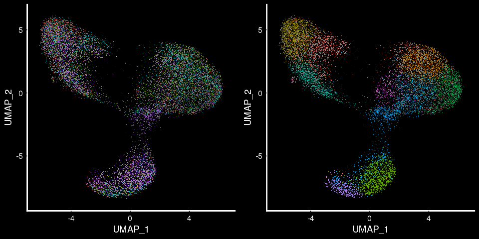
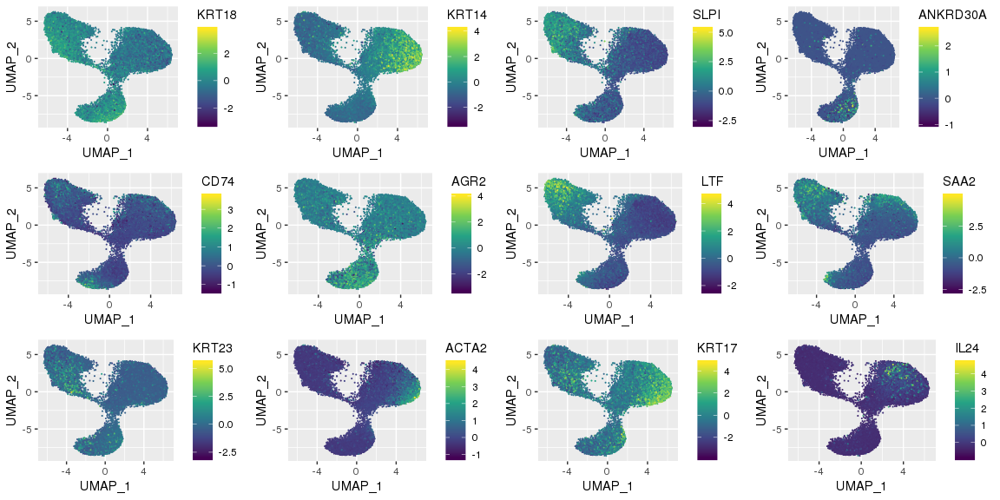
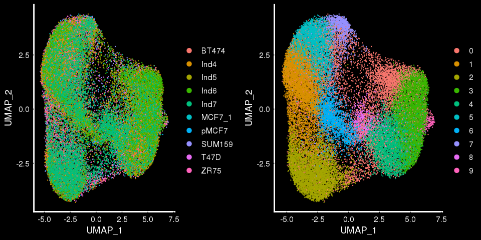
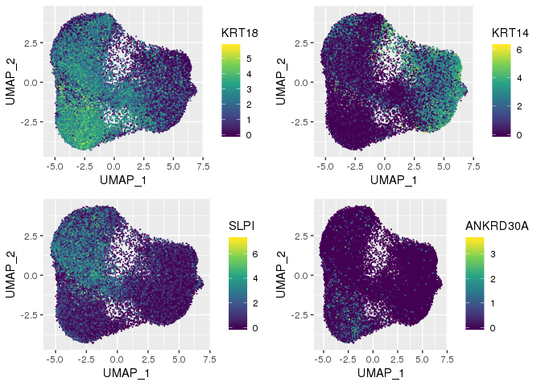
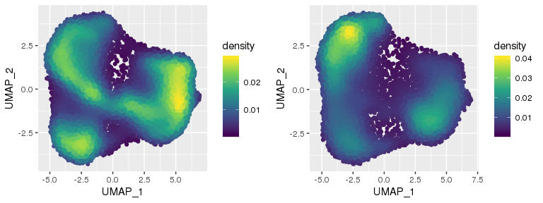
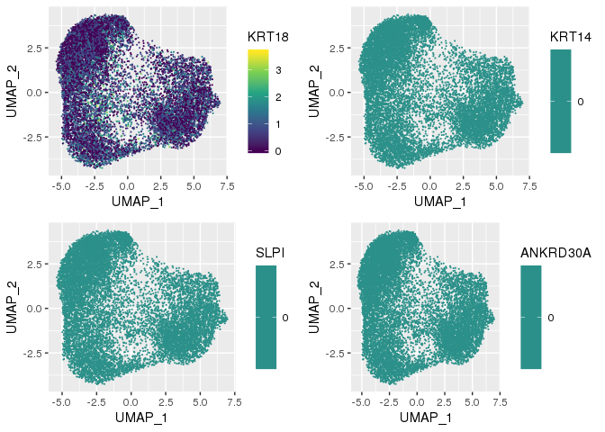
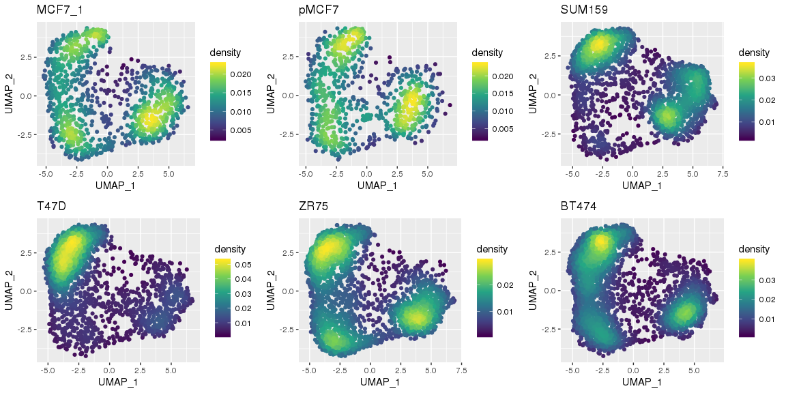
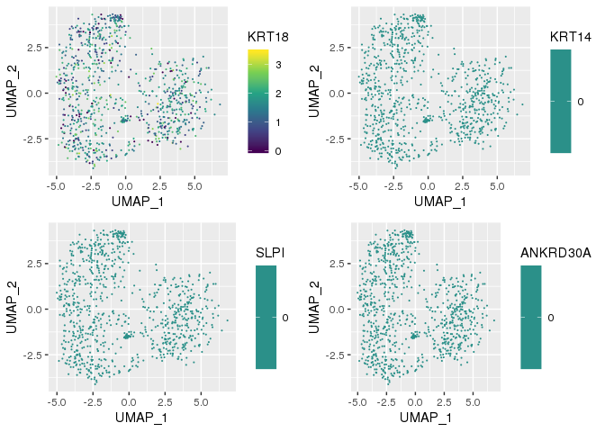
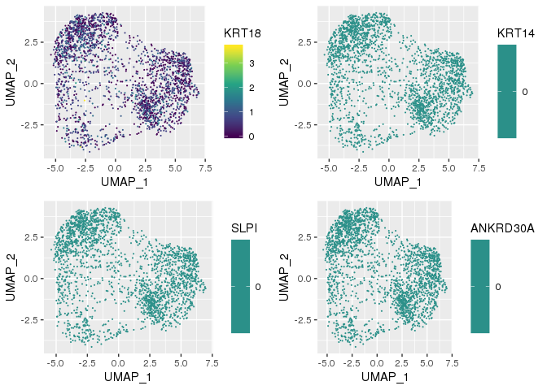

Analysis of integrated breast cancer atlas
==========================================

``` r
library(Seurat)
library(ggplot2)
```

[Nguyen, et. al](https://doi.org/10.1038/s41467-018-04334-1) used 10X Chromium single-cell RNA sequencing to profile gene expression in the mammary epithelial cells of 4 individuals. The raw count data from this experiment were [quality filtered using custom R scripts](https://github.com/jasenjackson/singlecell/blob/master/QC_Kessenbrock.md), normalized for sequencing depth using scTransform and [integrated using Seurat's reference-based integration method](https://github.com/jasenjackson/singlecell/blob/master/integrate.R). The louvain algorithm [was performed](https://github.com/jasenjackson/singlecell/blob/master/Integrated_Breast_Atlas) on the integrated dataset to identify community clusters.

 This analysis partially corroborated the marker genes originally identified by Nguyen, et. al. 

[Hinohara, et. al](https://doi.org/10.1016/j.ccell.2018.10.014) used InDrop single-cell RNA sequencing to profile the gene expression of 5 different breast cancer cell lines: MCF7 (x2), SUM159, T47D, ZR75 and BT474. The raw count data from this experiment were [quality filtered](https://github.com/jasenjackson/singlecell/blob/master/QC_polyak.md), and integrated using the above breast epithelial atlas as a reference.

``` r
BCatlas <- readRDS("/projects/b1101/Jasen/data/BreastCancerAtlas.integrated.rds")

# Perform louvain algorithm via the Seurat package to identify cell clusters
BCatlas <- FindNeighbors(BCatlas, dims = c(1:30), verbose = FALSE)
BCatlas <- FindClusters(BCatlas, verbose = FALSE)

# Plot by Individual and by Seurat cluster
p1 <- DimPlot(BCatlas, reduction = "umap", group.by = "sample_origin", pt.size=0.2) + DarkTheme()
p2 <- DimPlot(BCatlas, reduction = "umap", group.by = "seurat_clusters", pt.size=0.2) + DarkTheme()
gridExtra::grid.arrange(p1,p2, ncol=2)
```



``` r
DefaultAssay(object = BCatlas) <- "SCT"
featureMap.df <- FetchData(object = BCatlas, vars = c("UMAP_1", "UMAP_2",
                                                      "KRT18", "KRT14", "SLPI", "ANKRD30A"))

p1 <- ggplot(featureMap.df, aes(UMAP_1, UMAP_2, color = KRT18)) + geom_point(size=0.1) + scale_color_viridis_c()
p2 <- ggplot(featureMap.df, aes(UMAP_1, UMAP_2, color = KRT14)) + geom_point(size=0.1) + scale_color_viridis_c()
p3 <- ggplot(featureMap.df, aes(UMAP_1, UMAP_2, color = SLPI)) + geom_point(size=0.1) + scale_color_viridis_c()
p4 <- ggplot(featureMap.df, aes(UMAP_1, UMAP_2, color = ANKRD30A)) + geom_point(size=0.1) + scale_color_viridis_c()

gridExtra::grid.arrange(p1, p2, p3, p4, ncol = 2)
```



The three major clusters still appear to be present in this integrated dataset, but the distinctions between them are less clear. By separating malignant and normal data, we see slight changes in distribution.

``` r
## project markers onto normal cells
featureMap.normal.df <- FetchData(object = subset(BCatlas, subset = malignant == FALSE), vars = c("UMAP_1", "UMAP_2",
                                                                                                  "KRT18",  "KRT14", 
                                                                                                  "SLPI","ANKRD30A"))

p1 <- ggplot(featureMap.normal.df, aes(UMAP_1, UMAP_2, color = KRT18)) + geom_point(size=0.1) + scale_color_viridis_c()
p2 <- ggplot(featureMap.normal.df, aes(UMAP_1, UMAP_2, color = KRT14)) + geom_point(size=0.1) + scale_color_viridis_c()
p3 <- ggplot(featureMap.normal.df, aes(UMAP_1, UMAP_2, color = SLPI)) + geom_point(size=0.1) + scale_color_viridis_c()
p4 <- ggplot(featureMap.normal.df, aes(UMAP_1, UMAP_2, color = ANKRD30A)) + geom_point(size=0.1) + scale_color_viridis_c()

gridExtra::grid.arrange(p1, p2, p3, p4, ncol = 2)
```



``` r
## project markers onto malignant cells
featureMap.malignant.df <- FetchData(object = subset(BCatlas, subset = malignant == TRUE),  vars = c("UMAP_1", "UMAP_2",
                                                                                                     "KRT18",  "KRT14", 
                                                                                                     "SLPI","ANKRD30A"))

p5 <- ggplot(featureMap.malignant.df, aes(UMAP_1, UMAP_2, color = KRT18)) + geom_point(size=0.1) + scale_color_viridis_c()
p6 <- ggplot(featureMap.malignant.df, aes(UMAP_1, UMAP_2, color = KRT14)) + geom_point(size=0.1) + scale_color_viridis_c()
p7 <- ggplot(featureMap.malignant.df, aes(UMAP_1, UMAP_2, color = SLPI)) + geom_point(size=0.1) + scale_color_viridis_c()
p8 <- ggplot(featureMap.malignant.df, aes(UMAP_1, UMAP_2, color = ANKRD30A)) + geom_point(size=0.1) + scale_color_viridis_c()

gridExtra::grid.arrange(p5, p6, p7, p8, ncol = 2)
```



Separate UMAP results by cell-line.
-----------------------------------

Now we separate malignant cells by cell line and plot these markers to look for cell-line specific distributions. \#\# MCF7\_1

``` r
featureMap.MCF7_1.df <- FetchData(object = subset(BCatlas, subset = sample_origin == "MCF7_1"), vars = c("UMAP_1", "UMAP_2",
                                                                                                        "KRT18",  "KRT14", 
                                                                                                        "SLPI", "ANKRD30A"))

p1 <- ggplot(featureMap.MCF7_1.df, aes(UMAP_1, UMAP_2, color = KRT18)) + geom_point(size=0.1) + scale_color_viridis_c()
p2 <- ggplot(featureMap.MCF7_1.df, aes(UMAP_1, UMAP_2, color = KRT14)) + geom_point(size=0.1) + scale_color_viridis_c()
p3 <- ggplot(featureMap.MCF7_1.df, aes(UMAP_1, UMAP_2, color = SLPI)) + geom_point(size=0.1) + scale_color_viridis_c()
p4 <- ggplot(featureMap.MCF7_1.df, aes(UMAP_1, UMAP_2, color = ANKRD30A)) + geom_point(size=0.1) + scale_color_viridis_c()

gridExtra::grid.arrange(p1, p2, p3, p4, ncol = 2)
```

 \#\# MCF7\_2

``` r
featureMap.MCF7_2.df <- FetchData(object = subset(BCatlas, subset = sample_origin == "pMCF7"), vars = c("UMAP_1", "UMAP_2",
                                                                                                        "KRT18",  "KRT14", 
                                                                                                        "SLPI", "ANKRD30A"))

p1 <- ggplot(featureMap.MCF7_2.df, aes(UMAP_1, UMAP_2, color = KRT18)) + geom_point(size=0.1) + scale_color_viridis_c()
p2 <- ggplot(featureMap.MCF7_2.df, aes(UMAP_1, UMAP_2, color = KRT14)) + geom_point(size=0.1) + scale_color_viridis_c()
p3 <- ggplot(featureMap.MCF7_2.df, aes(UMAP_1, UMAP_2, color = SLPI)) + geom_point(size=0.1) + scale_color_viridis_c()
p4 <- ggplot(featureMap.MCF7_2.df, aes(UMAP_1, UMAP_2, color = ANKRD30A)) + geom_point(size=0.1) + scale_color_viridis_c()

gridExtra::grid.arrange(p1, p2, p3, p4, ncol = 2)
```

 \#\# SUM159

``` r
featureMap.SUM159.df <- FetchData(object = subset(BCatlas, subset = sample_origin == "SUM159"), vars = c("UMAP_1", "UMAP_2",
                                                                                                         "KRT18",  "KRT14", 
                                                                                                         "SLPI", "ANKRD30A"))

p1 <- ggplot(featureMap.SUM159.df, aes(UMAP_1, UMAP_2, color = KRT18)) + geom_point(size=0.1) + scale_color_viridis_c()
p2 <- ggplot(featureMap.SUM159.df, aes(UMAP_1, UMAP_2, color = KRT14)) + geom_point(size=0.1) + scale_color_viridis_c()
p3 <- ggplot(featureMap.SUM159.df, aes(UMAP_1, UMAP_2, color = SLPI)) + geom_point(size=0.1) + scale_color_viridis_c()
p4 <- ggplot(featureMap.SUM159.df, aes(UMAP_1, UMAP_2, color = ANKRD30A)) + geom_point(size=0.1) + scale_color_viridis_c()

gridExtra::grid.arrange(p1, p2, p3, p4, ncol = 2)
```



It may be better to create a UMAP density plot for each sample and show them altogether. MONDAY'S PROBLEM HAPPY FRIDAY
