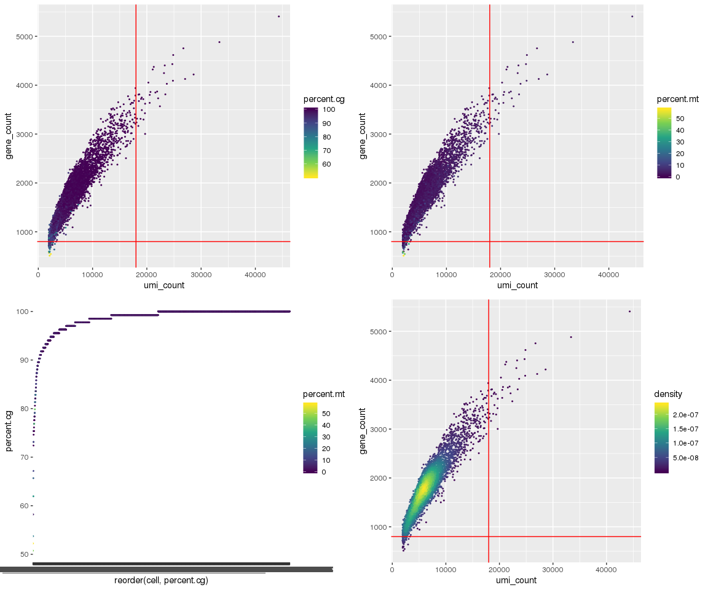
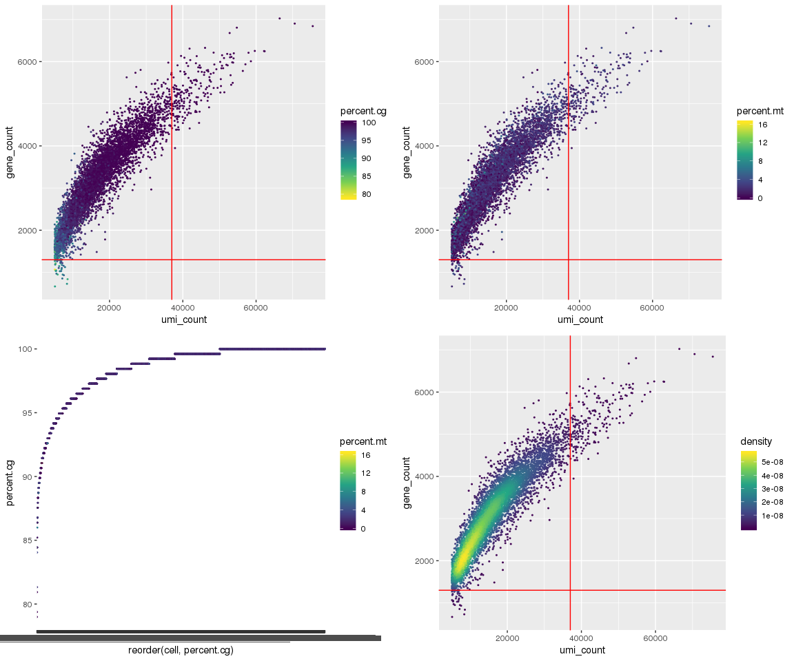
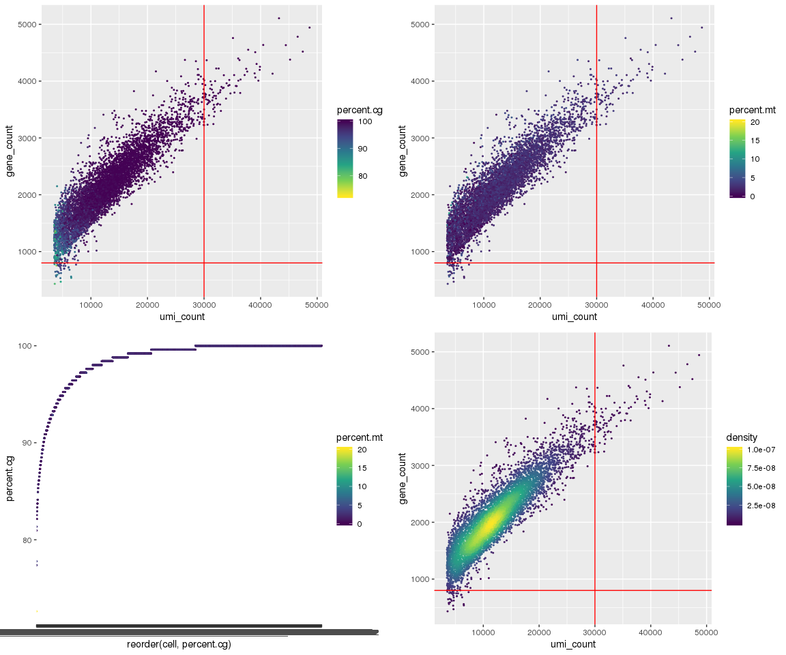
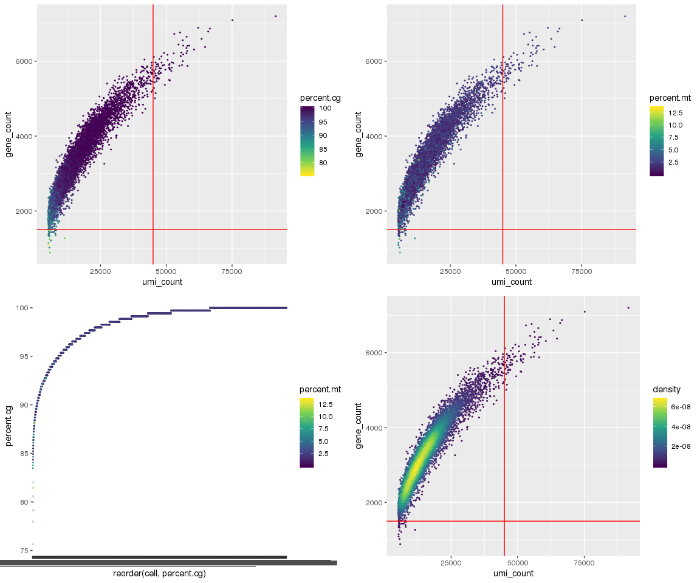

QC Filtering of Breast Epithelial Atlas
=======================================

``` r
# import packages and functions
setwd('/projects/b1101/Jasen')
source('singlecell/QCfunctions.R')

library(matrixStats)
library(scales)
library(ggplot2)
library(stringr)
library(dplyr)
library(MASS)
library(Seurat)
```

Individual 4
------------

``` r
# Import the count matrix
Ind4.mtx <- read.table(file = "/projects/b1101/Jasen/data/Breast_scRNA_Kessenbrock_Ind4.txt", header = TRUE, row.names=1)

# Calculate and plot QC statistics
Ind4.cellstats <- QCstats(Ind4.mtx, verbose=FALSE)
QCplot(Ind4.cellstats, hline=800, vline=18000) 
```



``` r
# Load count matrix and metadata into Seurat object & filter
Ind4.cellstats <- QCseurat(Ind4.cellstats) # formats cellstats matrix for Seurat
Ind4 <- CreateSeuratObject(count=Ind4.mtx, project="Breast_Ind4", meta.data=Ind4.cellstats)
Ind4 <- subset(x = Ind4, subset = percent.cg > 90 & gene_count > 800 & umi_count < 18000)
ncol(Ind4.mtx) - ncol(Ind4); ((ncol(Ind4.mtx)-ncol(Ind4)) / ncol(Ind4.mtx)) * 100
```

    ## [1] 151

    ## [1] 3.66861

151 cells (~3.7%) were filtered out.

``` r
# remove raw data from memory
rm(Ind4.cellstats); rm(Ind4.mtx)
```

Individual 5
------------

``` r
# Import the count matrix
Ind5.mtx <- read.table(file = "/projects/b1101/Jasen/data/Breast_scRNA_Kessenbrock_Ind5.txt", header = TRUE, row.names=1)

# Calculate and plot QC statistics
Ind5.cellstats <- QCstats(Ind5.mtx, verbose=FALSE)
QCplot(Ind5.cellstats, hline=1300, vline=37000) 
```



``` r
# Load count matrix and metadata into Seurat object & filter
Ind5.cellstats <- QCseurat(Ind5.cellstats) 
Ind5 <- CreateSeuratObject(count=Ind5.mtx, project="Breast_Ind5", meta.data=Ind5.cellstats) 
Ind5 <- subset(x = Ind5, subset = percent.cg > 90 & gene_count > 1300 & umi_count < 37000)
ncol(Ind5.mtx) - ncol(Ind5); ((ncol(Ind5.mtx)-ncol(Ind5)) / ncol(Ind5.mtx)) * 100
```

    ## [1] 310

    ## [1] 4.451465

310 cells (~4.45%) were filtered out.

``` r
# remove raw data from memory
rm(Ind5.cellstats); rm(Ind5.mtx)
```

Individual 6
------------

``` r
# Import the count matrix
Ind6.mtx <- read.table(file = "/projects/b1101/Jasen/data/Breast_scRNA_Kessenbrock_Ind6.txt", header = TRUE, row.names=1)

# Calculate and plot QC statistics
Ind6.cellstats <- QCstats(Ind6.mtx, verbose=FALSE)
QCplot(Ind6.cellstats, hline=800, vline=30000) 
```



``` r
# Load count matrix and metadata into Seurat object & filter
Ind6.cellstats <- QCseurat(Ind6.cellstats) 
Ind6 <- CreateSeuratObject(count=Ind6.mtx, project="Breast_Ind6", meta.data=Ind6.cellstats) 
Ind6 <- subset(x = Ind6, subset = percent.cg > 90 & gene_count > 800 & umi_count < 30000)
ncol(Ind6.mtx) - ncol(Ind6); ((ncol(Ind6.mtx)-ncol(Ind6)) / ncol(Ind6.mtx)) * 100
```

    ## [1] 258

    ## [1] 4.28999

258 cells (~4.3%) were filtered out.

``` r
# remove raw data from memory
rm(Ind6.cellstats); rm(Ind6.mtx)
```

Individual 7
------------

``` r
# Import the count matrix
Ind7.mtx <- read.table(file = "/projects/b1101/Jasen/data/Breast_scRNA_Kessenbrock_Ind7.txt", header = TRUE, row.names=1)

# Calculate and plot QC statistics
Ind7.cellstats <- QCstats(Ind7.mtx, verbose=FALSE)
QCplot(Ind7.cellstats, hline=1500, vline=45000) 
```



``` r
# Load count matrix and metadata into Seurat object & filter
Ind7.cellstats <- QCseurat(Ind7.cellstats) 
Ind7 <- CreateSeuratObject(count=Ind7.mtx, project="Breast_Ind7", meta.data=Ind7.cellstats) 
Ind7 <- subset(x = Ind7, subset = percent.cg > 90 & gene_count > 1500 & umi_count < 45000)
ncol(Ind7.mtx) - ncol(Ind7); ((ncol(Ind7.mtx)-ncol(Ind7)) / ncol(Ind7.mtx)) * 100
```

    ## [1] 219

    ## [1] 2.899894

219 cells (~2.9%) were filtered out.

``` r
# remove raw data from memory
rm(Ind7.cellstats); rm(Ind7.mtx)
```

Merging Seurat objects together
-------------------------------

``` r
BreastAtlas <- merge(x = Ind4, y = list(Ind5, Ind6, Ind7))
rm(Ind4); rm(Ind5); rm(Ind6); rm(Ind7)
head(BreastAtlas[[]])
```

    ##                     orig.ident nCount_RNA nFeature_RNA umi_count
    ## Ind4_AAACATACGTACAC       Ind4       8761         2317      8761
    ## Ind4_AAACATTGCCTCCA       Ind4       4568         1402      4568
    ## Ind4_AAACATTGTGAAGA       Ind4      10450         2324     10450
    ## Ind4_AAACCGTGCCTTAT       Ind4      12362         3042     12362
    ## Ind4_AAACCGTGCTACTT       Ind4       4317         1405      4317
    ## Ind4_AAACCGTGTGTGGT       Ind4       8974         2129      8974
    ##                     gene_count percent.mt percent.cg
    ## Ind4_AAACATACGTACAC       2317   2.328501  100.00000
    ## Ind4_AAACATTGCCTCCA       1402   2.145359   98.50746
    ## Ind4_AAACATTGTGAAGA       2324   4.028708  100.00000
    ## Ind4_AAACCGTGCCTTAT       3042   2.038505  100.00000
    ## Ind4_AAACCGTGCTACTT       1405   1.088719   99.25373
    ## Ind4_AAACCGTGTGTGGT       2129   5.460218  100.00000

``` r
#remove default Seurat columns to reduce file size
BreastAtlas[["individual"]] <- BreastAtlas[["orig.ident"]]
BreastAtlas[["nCount_RNA"]] <- NULL
BreastAtlas[["nFeature_RNA"]] <- NULL
head(BreastAtlas[[]])
```

    ##                     orig.ident umi_count gene_count percent.mt percent.cg
    ## Ind4_AAACATACGTACAC       Ind4      8761       2317   2.328501  100.00000
    ## Ind4_AAACATTGCCTCCA       Ind4      4568       1402   2.145359   98.50746
    ## Ind4_AAACATTGTGAAGA       Ind4     10450       2324   4.028708  100.00000
    ## Ind4_AAACCGTGCCTTAT       Ind4     12362       3042   2.038505  100.00000
    ## Ind4_AAACCGTGCTACTT       Ind4      4317       1405   1.088719   99.25373
    ## Ind4_AAACCGTGTGTGGT       Ind4      8974       2129   5.460218  100.00000
    ##                     individual
    ## Ind4_AAACATACGTACAC       Ind4
    ## Ind4_AAACATTGCCTCCA       Ind4
    ## Ind4_AAACATTGTGAAGA       Ind4
    ## Ind4_AAACCGTGCCTTAT       Ind4
    ## Ind4_AAACCGTGCTACTT       Ind4
    ## Ind4_AAACCGTGTGTGGT       Ind4

``` r
saveRDS(BreastAtlas, file="/projects/b1101/Jasen/data/BreastAtlas.rds")
```
