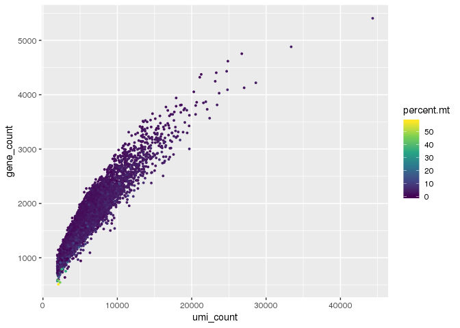
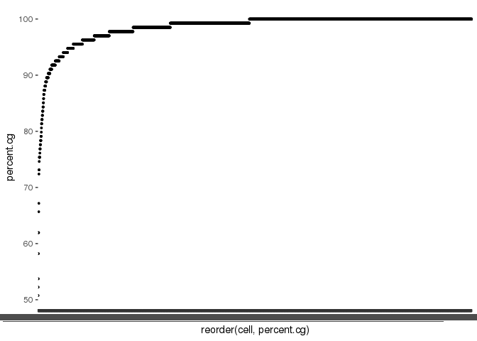
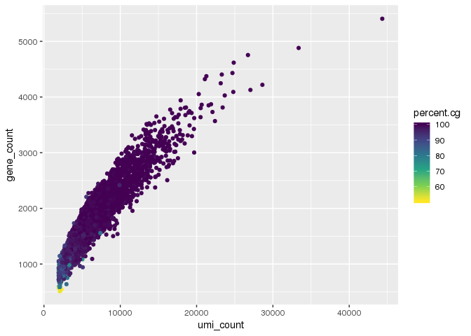

QC Filtering of Breast Epithelial Atlas
=======================================

``` r
# import packages and functions
setwd('/projects/b1101/Jasen')
source('singlecell/QCfunctions.R')

library(matrixStats)
library(scales)
library(ggplot2)
library(stringr)
library(dplyr)
```

Import the count matrix
-----------------------

Import the count matrix for individual 4 from the Breast Epithelial atlas (Nguyen, et. al 2018; <doi:%5B10.1038/s41467-018-04334-1%5D(https://www.nature.com/articles/s41467-018-04334-1)>. The rows are genes and the columns are cells.

``` r
Ind4.df <- read.table(file = "/projects/b1101/Jasen/data/Breast_scRNA_Kessenbrock_Ind4.txt", header = TRUE, row.names=1)
head(Ind4.df[,1:4])
```

    ##               Ind4_AAACATACGTACAC Ind4_AAACATTGCCTCCA Ind4_AAACATTGTGAAGA
    ## RP11-34P13.3                    0                   0                   0
    ## FAM138A                         0                   0                   0
    ## OR4F5                           0                   0                   0
    ## RP11-34P13.7                    0                   0                   0
    ## RP11-34P13.8                    0                   0                   0
    ## RP11-34P13.14                   0                   0                   0
    ##               Ind4_AAACATTGTTCTTG
    ## RP11-34P13.3                    0
    ## FAM138A                         0
    ## OR4F5                           0
    ## RP11-34P13.7                    0
    ## RP11-34P13.8                    0
    ## RP11-34P13.14                   0

Calculate statistics for each gene and cell.
--------------------------------------------

The mean and standard deviation and % of cells expressing each gene are computed by the stats\_by\_gene() function.

``` r
Ind4.genestats <- stats_by_gene(Ind4.df)
Ind4.genestats[1:4,]
```

    ##   n        mean         sd   percent
    ## 1 0 0.000000000 0.00000000 0.0000000
    ## 2 0 0.000000000 0.00000000 0.0000000
    ## 3 0 0.000000000 0.00000000 0.0000000
    ## 4 6 0.001457726 0.03815697 0.1457726

The gene count, read (umi) count and percent of reads mapped to mitochondrial genes ('percent.mt') are calculated by default using the stats\_by\_cell() function. If the matrix computed by the stats\_by\_gene() function is included then 'percent.cg', an additional QC metric, is calculated.

The stats\_by\_gene() function calculates the % of cells expressing each gene, and stats\_by\_cell() uses this metric to define a set of housekeeping genes or common genes (expressed in &gt;95% of cells). The % of housekeeping (common) genes expressed in each cell is then saved in the 'percent.cg' column.

``` r
Ind4.cellstats <- stats_by_cell(Ind4.df, Ind4.genestats, common_genes=TRUE)
```

    ## Counting the # of reads found in each cell 
    ## Counting the # of genes expressed in each cell 
    ## Counting the # of mitochondrial reads in each cell 
    ## Calculating % reads mapping to mitochondrial genes for each cell 
    ## Identifying housekeeping genes (genes expressed in >95% of cells) 
    ## Calculating % of house keeping genes expressed in each cell

``` r
Ind4.cellstats[1:4,]
```

    ##                  cell umi_count gene_count percent.mt percent.cg
    ## 1 Ind4_AAACATACGTACAC      8761       2317   2.328501  100.00000
    ## 2 Ind4_AAACATTGCCTCCA      4568       1402   2.145359   98.50746
    ## 3 Ind4_AAACATTGTGAAGA     10450       2324   4.028708  100.00000
    ## 4 Ind4_AAACATTGTTCTTG      2745        921  16.794171   81.34328

Typically, cells are filtered jointly by gene count, umi count and percentage of mitochondrial genes. Low quality cells tend to have low values for each of these features.

``` r
ggplot(Ind4.cellstats, aes(umi_count, gene_count, color = percent.mt)) +
       geom_point(size=0.7) +
       scale_color_viridis_c()
```



Percentage of housekeeping genes (common genes percentage) may be a more precise alternative to filtering on mitochondrial percentage. We can plot % of common genes detected in each cell to determine a cutoff.

``` r
ggplot(Ind4.cellstats, aes(reorder(cell, percent.cg), percent.cg))  + 
       geom_point(size=0.7) 
```

 It looks like there is an elbow around 85%. We can compare this cutoff to gene count and umi\_count.

``` r
ggplot(Ind4.cellstats, aes(umi_count, gene_count, color=percent.cg)) +
  geom_point() +
  scale_color_viridis_c(direction = -1)
```


