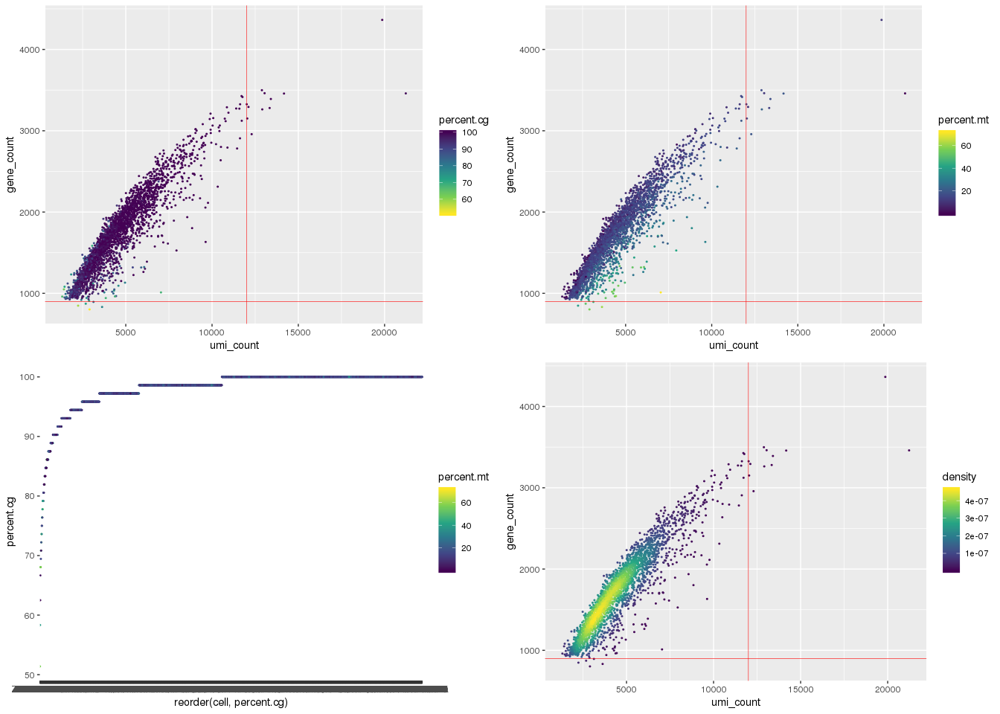

QC of breast cancer cell line data (scRNA-seq) from the [Polyak lab](https://www.polyaklab.dfci.harvard.edu/)
=============================================================================================================

``` r
# import packages and functions
setwd('/projects/b1101/Jasen')
source('singlecell/QCfunctions.R')

library(matrixStats)
library(scales)
library(ggplot2)
library(stringr)
library(dplyr)
library(MASS)
library(Seurat)
```

MCF7 \#1 ([GSM2813220](https://www.ncbi.nlm.nih.gov/geo/query/acc.cgi?acc=GSM2813220))
--------------------------------------------------------------------------------------

``` r
# Import the count matrix
MCF7_1.mtx <- read.table(file = "/projects/b1101/Jasen/data/GSM2813220_MCF7.tsv", header = TRUE, row.names=1)
ncol(MCF7_1.mtx); nrow(MCF7_1.mtx)
```

    ## [1] 1175

    ## [1] 7738

``` r
# Calculate and plot QC statistics
MCF7_1.cellstats <- QCstats(MCF7_1.mtx, verbose=FALSE)
QCplot(MCF7_1.cellstats, hline=1000, vline=10000) 
```

 1175 cells, 7,738 genes.

``` r
# Load count matrix and metadata into Seurat object & filter
MCF7_1.meta <- QCseurat(MCF7_1.cellstats) # formats cellstats matrix for Seurat
MCF7_1 <- CreateSeuratObject(count=MCF7_1.mtx, project="MCF7_1", meta.data=MCF7_1.meta)
MCF7_1 <- subset(x = MCF7_1, subset = percent.cg > 90 & gene_count > 1000 & umi_count < 10000 & percent.mt < 50)
ncol(MCF7_1.mtx) - ncol(MCF7_1); ((ncol(MCF7_1.mtx)-ncol(MCF7_1)) / ncol(MCF7_1.mtx)) * 100
```

    ## [1] 62

    ## [1] 5.276596

62 cells (5.276%) removed.

``` r
# remove raw data from memory
rm(MCF7_1.cellstats); rm(MCF7_1.mtx); rm(MCF7_1.meta)
```

MCF7 \#2 ([GSM2813221](https://www.ncbi.nlm.nih.gov/geo/query/acc.cgi?acc=GSM2813221))
--------------------------------------------------------------------------------------

``` r
# Import the count matrix
MCF7_2.mtx <- read.table(file = "/projects/b1101/Jasen/data/GSM2813221_pMCF7.tsv", header = TRUE, row.names=1)
ncol(MCF7_2.mtx); nrow(MCF7_2.mtx)
```

    ## [1] 927

    ## [1] 7738

``` r
# Calculate and plot QC statistics
MCF7_2.cellstats <- QCstats(MCF7_2.mtx, verbose=FALSE)
QCplot(MCF7_2.cellstats, vline = 7000) 
```

 927 cells, 7,738 genes detected. Low over-all gene count per cell, so this will not be used to filter these cells.

``` r
# Load count matrix and metadata into Seurat object & filter
MCF7_2.meta <- QCseurat(MCF7_2.cellstats) # formats cellstats matrix for Seurat
MCF7_2 <- CreateSeuratObject(count=MCF7_2.mtx, project="MCF7_2", meta.data=MCF7_2.meta)
MCF7_2 <- subset(x = MCF7_2, subset = percent.cg > 90 & percent.mt < 50 & umi_count < 7000)
ncol(MCF7_2.mtx) - ncol(MCF7_2); ((ncol(MCF7_2.mtx)-ncol(MCF7_2)) / ncol(MCF7_2.mtx)) * 100
```

    ## [1] 48

    ## [1] 5.177994

48 cells (~5.2%) were removed.

``` r
# remove raw data from memory
rm(MCF7_2.cellstats); rm(MCF7_2.mtx); rm(MCF7_2.meta)
```

SUM159 ([GSM2813221](https://www.ncbi.nlm.nih.gov/geo/query/acc.cgi?acc=GSM2813221))
------------------------------------------------------------------------------------

``` r
# Import the count matrix
SUM159.mtx <- read.table(file = "/projects/b1101/Jasen/data/GSM2813221_SUM159.tsv", header = TRUE, row.names=1)
ncol(SUM159.mtx); nrow(SUM159.mtx)
```

    ## [1] 2276

    ## [1] 7738

``` r
# Calculate and plot QC statistics
SUM159.cellstats <- QCstats(SUM159.mtx, verbose=FALSE)
QCplot(SUM159.cellstats, hline=1000, vline=9000) 
```

 2,276 cells, 7,738 genes were detected. May be able to filter up to &gt;95% percent.cg expressed!

``` r
# Load count matrix and metadata into Seurat object & filter
SUM159.meta <- QCseurat(SUM159.cellstats) # formats cellstats matrix for Seurat
SUM159 <- CreateSeuratObject(count=SUM159.mtx, project="SUM159", meta.data=SUM159.meta)
SUM159 <- subset(x = SUM159, subset = percent.cg > 90 & gene_count > 1000 & umi_count < 9000 & percent.mt < 50)
ncol(SUM159.mtx) - ncol(SUM159); ((ncol(SUM159.mtx)-ncol(SUM159)) / ncol(SUM159.mtx)) * 100
```

    ## [1] 43

    ## [1] 1.889279

43 cells (1.9%) were removed.

``` r
# remove raw data from memory
rm(SUM159.cellstats); rm(SUM159.mtx); rm(SUM159.meta)
```

BT474 ([GSM3329993](https://www.ncbi.nlm.nih.gov/geo/query/acc.cgi?acc=GSM3329993))
-----------------------------------------------------------------------------------

``` r
# Import the count matrix
BT474.mtx <- read.table(file = "/projects/b1101/Jasen/data/GSM3329993_BT474.tsv", header = TRUE, row.names=1)
ncol(BT474.mtx); nrow(BT474.mtx)
```

    ## [1] 3562

    ## [1] 8019

``` r
head(BT474.mtx[,1:3])
```

    ##       BT474.bcIIAD BT474.bcBSFT BT474.bcDZXX
    ## AAAS             0            0            0
    ## AACS             1            0            1
    ## AAGAB            0            0            0
    ## AAMP             1            2            0
    ## AAR2             3            0            0
    ## AARD             0            0            0

``` r
# Calculate and plot QC statistics
BT474.cellstats <- QCstats(BT474.mtx, verbose=FALSE)
QCplot(BT474.cellstats,hline=950, vline=9000) 
```

 3,562 cells, 8,019 genes detected. Very high overall mt %, not filtered out.

``` r
# Load count matrix and metadata into Seurat object & filter
BT474.meta <- QCseurat(BT474.cellstats) # formats cellstats matrix for Seurat
BT474 <- CreateSeuratObject(count=BT474.mtx, project="BT474", meta.data=BT474.meta)
BT474 <- subset(x = BT474, subset = percent.cg > 90 & gene_count > 950 & umi_count < 9000)
ncol(BT474.mtx) - ncol(BT474); ((ncol(BT474.mtx)-ncol(BT474)) / ncol(BT474.mtx)) * 100
```

    ## [1] 78

    ## [1] 2.189781

78 cells (~2.2%) were removed.

``` r
# remove raw data from memory
rm(BT474.cellstats); rm(BT474.mtx); rm(BT474.meta)
```

T47D ([GSM3329993](https://www.ncbi.nlm.nih.gov/geo/query/acc.cgi?acc=GSM3329993))
----------------------------------------------------------------------------------

``` r
# Import the count matrix
T47D.mtx <- read.table(file = "/projects/b1101/Jasen/data/GSM3329993_T47D.tsv", header = TRUE, row.names=1)
ncol(T47D.mtx); nrow(T47D.mtx)
```

    ## [1] 2530

    ## [1] 8019

``` r
head(T47D.mtx[,1:3])
```

    ##       T47D.bcFNUW T47D.bcFPKW T47D.bcFNXB
    ## AAAS            0           1           2
    ## AACS            0           1           0
    ## AAGAB           0           0           0
    ## AAMP            1           0           0
    ## AAR2            1           1           1
    ## AARD            1           0           0

``` r
# Calculate and plot QC statistics
T47D.cellstats <- QCstats(T47D.mtx, verbose=FALSE)
QCplot(T47D.cellstats, vline=8000) 
```

 2,530 cells, 8,019 genes detected. High percent.mt, low gene count.

``` r
# Load count matrix and metadata into Seurat object & filter
T47D.meta <- QCseurat(T47D.cellstats) # formats cellstats matrix for Seurat
T47D <- CreateSeuratObject(count=T47D.mtx, project="T47D", meta.data=T47D.meta)
T47D <- subset(x = T47D, subset = percent.cg > 90 & umi_count < 8000 & percent.mt < 50)
ncol(T47D.mtx) - ncol(T47D); ((ncol(T47D.mtx)-ncol(T47D)) / ncol(T47D.mtx)) * 100
```

    ## [1] 104

    ## [1] 4.110672

104 cells (~4.1%) removed.

``` r
# remove raw data from memory
rm(T47D.cellstats); rm(T47D.mtx); rm(T47D.meta)
```

ZR75 ([GSM3329993](https://www.ncbi.nlm.nih.gov/geo/query/acc.cgi?acc=GSM3329993))
----------------------------------------------------------------------------------

``` r
# Import the count matrix
ZR75.mtx <- read.table(file = "/projects/b1101/Jasen/data/GSM3329993_ZR75.tsv", header = TRUE, row.names=1)
ncol(ZR75.mtx); nrow(ZR75.mtx)
```

    ## [1] 2811

    ## [1] 8019

``` r
head(ZR75.mtx[,1:5])
```

    ##       ZR75.bcAURQ ZR75.bcIIDI ZR75.bcHYSB ZR75.bcHTNA ZR75.bcGIZT
    ## AAAS            0           0           0           0           0
    ## AACS            0           0           2           0           0
    ## AAGAB           3           1           1           3           1
    ## AAMP            1           0           0           0           0
    ## AAR2            1           1           2           2           0
    ## AARD            0           0           0           0           0

``` r
# Calculate and plot QC statistics
ZR75.cellstats <- QCstats(ZR75.mtx, verbose=FALSE)
QCplot(ZR75.cellstats, hline = 900, vline = 12000) 
```

 2,811 cells, 8,019 genes detected. High percent.mt

``` r
# Load count matrix and metadata into Seurat object & filter
ZR75.meta <- QCseurat(ZR75.cellstats) # formats cellstats matrix for Seurat
ZR75 <- CreateSeuratObject(count=ZR75.mtx, project="ZR75", meta.data=ZR75.meta)
ZR75 <- subset(x = ZR75, subset = percent.cg > 90 & gene_count > 900 & umi_count < 12000 & percent.mt < 50)
ncol(ZR75.mtx) - ncol(ZR75); ((ncol(ZR75.mtx)-ncol(ZR75)) / ncol(ZR75.mtx)) * 100
```

    ## [1] 109

    ## [1] 3.877624

 109 cells (~3.9%) were removed.

``` r
# remove raw data from memory
rm(ZR75.cellstats); rm(ZR75.mtx); rm(ZR75.meta)
```

Merging cell lines with Breast Epithelial Atlas
-----------------------------------------------

Each cell line was first merged into an aggregate 'BreastCancerAtlas' object. The datasets will be split by 'sample\_origin' before reference-based integration.

``` r
BreastCancerAtlas <- merge(x = MCF7_1, y = list(MCF7_2, SUM159, T47D, ZR75, BT474))
rm(MCF7_1, MCF7_2, SUM159, T47D, ZR75, BT474)
ncol(BreastCancerAtlas); nrow(BreastCancerAtlas)
```

    ## [1] 12837

    ## [1] 8476

``` r
# create 'malignant' & 'is_from_cell_line' boolean column for integration
malignant <- rep(TRUE, ncol(BreastCancerAtlas))
BreastCancerAtlas[["malignant"]] <- malignant

cell_line <- rep(TRUE, ncol(BreastCancerAtlas))
BreastCancerAtlas[["cell_line"]] <- cell_line

#remove default Seurat columns to reduce file size
BreastCancerAtlas[["sample_origin"]] <- BreastCancerAtlas[["orig.ident"]]
BreastCancerAtlas[["nCount_RNA"]] <- NULL
BreastCancerAtlas[["nFeature_RNA"]] <- NULL
head(BreastCancerAtlas[[]])
```

    ##             orig.ident umi_count gene_count percent.mt percent.cg
    ## MCF7.bcAONH     MCF7_1      7811       2600   8.846499  100.00000
    ## MCF7.bcDILR     MCF7_1      7354       2513   9.069894  100.00000
    ## MCF7.bcAFKP     MCF7_1      5645       2082   4.216120  100.00000
    ## MCF7.bcFUVU     MCF7_1      4752       1842   5.450337   99.27536
    ## MCF7.bcFXIV     MCF7_1      4091       1551   8.457590  100.00000
    ## MCF7.bcGNHW     MCF7_1      3319       1568  10.756252   97.82609
    ##             malignant cell_line sample_origin
    ## MCF7.bcAONH      TRUE      TRUE        MCF7_1
    ## MCF7.bcDILR      TRUE      TRUE        MCF7_1
    ## MCF7.bcAFKP      TRUE      TRUE        MCF7_1
    ## MCF7.bcFUVU      TRUE      TRUE        MCF7_1
    ## MCF7.bcFXIV      TRUE      TRUE        MCF7_1
    ## MCF7.bcGNHW      TRUE      TRUE        MCF7_1

The integrated breast epithelial dataset was then joined with the breast cancer cell lines.

``` r
BreastAtlas.integrated <- readRDS(file="/projects/b1101/Jasen/data/BreastAtlas.integrated.rds") 
ncol(BreastAtlas.integrated); nrow(BreastAtlas.integrated)
```

    ## [1] 23708

    ## [1] 3000

``` r
BreastAtlas.integrated[["sample_origin"]] <- BreastAtlas.integrated[["individual"]]
BreastAtlas.integrated[["individual"]] <- NULL

# set malignant & cell_line columns
malignant <- rep(FALSE, ncol(BreastAtlas.integrated))
BreastAtlas.integrated[["malignant"]] <- malignant

cell_line <- rep(FALSE, ncol(BreastAtlas.integrated))
BreastAtlas.integrated[["cell_line"]] <- cell_line

head(BreastAtlas.integrated[[]])
```

    ##                     orig.ident umi_count gene_count percent.mt percent.cg
    ## Ind4_AAACATACGTACAC       Ind4      8761       2317   2.328501  100.00000
    ## Ind4_AAACATTGCCTCCA       Ind4      4568       1402   2.145359   98.50746
    ## Ind4_AAACATTGTGAAGA       Ind4     10450       2324   4.028708  100.00000
    ## Ind4_AAACCGTGCCTTAT       Ind4     12362       3042   2.038505  100.00000
    ## Ind4_AAACCGTGCTACTT       Ind4      4317       1405   1.088719   99.25373
    ## Ind4_AAACCGTGTGTGGT       Ind4      8974       2129   5.460218  100.00000
    ##                     nCount_RNA nFeature_RNA nCount_SCT nFeature_SCT
    ## Ind4_AAACATACGTACAC       8761         2317       6864         2306
    ## Ind4_AAACATTGCCTCCA       4568         1402       5879         1402
    ## Ind4_AAACATTGTGAAGA      10450         2324       6896         2238
    ## Ind4_AAACCGTGCCTTAT      12362         3042       7252         2889
    ## Ind4_AAACCGTGCTACTT       4317         1405       5789         1410
    ## Ind4_AAACCGTGTGTGGT       8974         2129       6854         2120
    ##                     sample_origin malignant cell_line
    ## Ind4_AAACATACGTACAC          Ind4     FALSE     FALSE
    ## Ind4_AAACATTGCCTCCA          Ind4     FALSE     FALSE
    ## Ind4_AAACATTGTGAAGA          Ind4     FALSE     FALSE
    ## Ind4_AAACCGTGCCTTAT          Ind4     FALSE     FALSE
    ## Ind4_AAACCGTGCTACTT          Ind4     FALSE     FALSE
    ## Ind4_AAACCGTGTGTGGT          Ind4     FALSE     FALSE

``` r
# Merge non-malignant reference cells 'under' cell line data
BreastCancerAtlas <- merge(x = BreastCancerAtlas, y = BreastAtlas.integrated)
ncol(BreastCancerAtlas); nrow(BreastCancerAtlas)
```

    ## [1] 36545

    ## [1] 33813

``` r
# remove redundant columns
BreastCancerAtlas[["nCount_RNA"]] <- NULL
BreastCancerAtlas[["nFeature_RNA"]] <- NULL

head(BreastCancerAtlas[[]])
```

    ##             orig.ident umi_count gene_count percent.mt percent.cg
    ## MCF7.bcAONH     MCF7_1      7811       2600   8.846499  100.00000
    ## MCF7.bcDILR     MCF7_1      7354       2513   9.069894  100.00000
    ## MCF7.bcAFKP     MCF7_1      5645       2082   4.216120  100.00000
    ## MCF7.bcFUVU     MCF7_1      4752       1842   5.450337   99.27536
    ## MCF7.bcFXIV     MCF7_1      4091       1551   8.457590  100.00000
    ## MCF7.bcGNHW     MCF7_1      3319       1568  10.756252   97.82609
    ##             malignant cell_line sample_origin nCount_SCT nFeature_SCT
    ## MCF7.bcAONH      TRUE      TRUE        MCF7_1         NA           NA
    ## MCF7.bcDILR      TRUE      TRUE        MCF7_1         NA           NA
    ## MCF7.bcAFKP      TRUE      TRUE        MCF7_1         NA           NA
    ## MCF7.bcFUVU      TRUE      TRUE        MCF7_1         NA           NA
    ## MCF7.bcFXIV      TRUE      TRUE        MCF7_1         NA           NA
    ## MCF7.bcGNHW      TRUE      TRUE        MCF7_1         NA           NA

``` r
tail(BreastCancerAtlas[[]])
```

    ##                         orig.ident umi_count gene_count percent.mt
    ## Ind7_TTTGTCAGTACAAGTA.3       Ind7      9580       2667   2.035491
    ## Ind7_TTTGTCAGTACTTGAC.3       Ind7     17836       3732   1.474546
    ## Ind7_TTTGTCAGTGTCTGAT.3       Ind7      9409       2598   3.762355
    ## Ind7_TTTGTCAGTTCACCTC.3       Ind7      9713       3055   1.369299
    ## Ind7_TTTGTCATCAACACTG.3       Ind7     26018       4328   1.245292
    ## Ind7_TTTGTCATCTCACATT.3       Ind7     14201       3280   2.042110
    ##                         percent.cg malignant cell_line sample_origin
    ## Ind7_TTTGTCAGTACAAGTA.3   99.13043     FALSE     FALSE          Ind7
    ## Ind7_TTTGTCAGTACTTGAC.3  100.00000     FALSE     FALSE          Ind7
    ## Ind7_TTTGTCAGTGTCTGAT.3   97.39130     FALSE     FALSE          Ind7
    ## Ind7_TTTGTCAGTTCACCTC.3   99.13043     FALSE     FALSE          Ind7
    ## Ind7_TTTGTCATCAACACTG.3  100.00000     FALSE     FALSE          Ind7
    ## Ind7_TTTGTCATCTCACATT.3   99.13043     FALSE     FALSE          Ind7
    ##                         nCount_SCT nFeature_SCT
    ## Ind7_TTTGTCAGTACAAGTA.3      13862         2680
    ## Ind7_TTTGTCAGTACTTGAC.3      15232         3732
    ## Ind7_TTTGTCAGTGTCTGAT.3      13815         2633
    ## Ind7_TTTGTCAGTTCACCTC.3      13680         3068
    ## Ind7_TTTGTCATCAACACTG.3      15423         3961
    ## Ind7_TTTGTCATCTCACATT.3      14374         3279

``` r
saveRDS(BreastCancerAtlas, file="/projects/b1101/Jasen/data/BreastCancerAtlas.rds")
```
